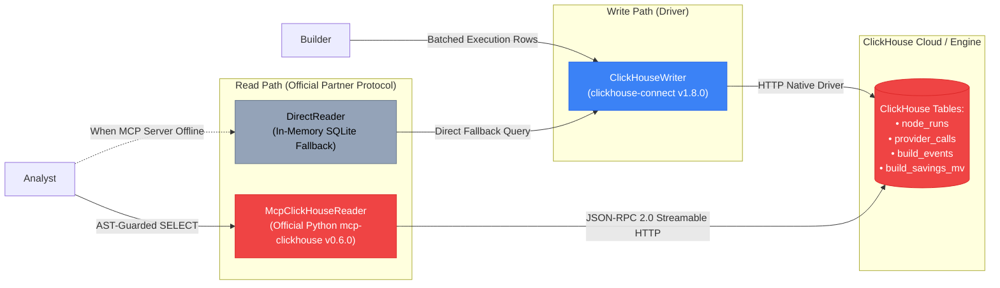

# CONFORM

<div align="center">

# CONFORM
### The Generative Media Compiler

**Compile generative media. Don't regenerate it.**

A deterministic build compiler and Google ADK orchestrator for AI video advertising slates. When prompts or advertising regulations change across 40 localized territories, CONFORM tracks fine-grained input dependencies, previews the blast radius and cost before spend, halts at an enforced human approval gate, rebuilds only the dirty subtree, and proves cryptographic release integrity with ClickHouse event telemetry.

[](https://opensource.org/licenses/Apache-2.0)
[](https://agentic-cinema.devpost.com/)
[](https://clickhouse.com/)
[](https://cloud.google.com/vertex-ai)
[](https://github.com/google/adk-python)
[-brightgreen.svg)](tests/)
[](https://github.com/astral-sh/ruff)
[](https://cloud.google.com/run)

**[🌐 Open Hosted Live Demo](https://conform-tiwoc77ijq-ew.a.run.app)** · **[🎥 Watch Demo Video](docs/demo_recording.mp4)** · **[🏆 Devpost Submission](docs/DEVPOST_SUBMISSION.md)** · **[📜 Provenance & Clean IP](PROVENANCE.md)**

</div>

---

## Quick Links

| Resource | Description | Location |
|---|---|---|
| **Live Hosted Demo** | Interactive Cloud Run app running in **Public Judge Mode** with cached media & MCP reads | [conform-tiwoc77ijq-ew.a.run.app](https://conform-tiwoc77ijq-ew.a.run.app) |
| **Demo Video** | 3-minute technical walkthrough demonstrating blast radius, approval gate, and byte verification | [docs/demo_recording.mp4](docs/demo_recording.mp4) |
| **Devpost Submission** | Full submission package, inspiration, challenges, and track criteria answers | [docs/DEVPOST_SUBMISSION.md](docs/DEVPOST_SUBMISSION.md) |
| **Clean IP Provenance** | Detailed provenance log verifying new contest-period work, Google-only AI, and zero prior code | [PROVENANCE.md](PROVENANCE.md) |
| **Architectural Invariants** | Core laws, LLM/deterministic boundary rules, and state machine invariants | [AGENTS.md](AGENTS.md) |
| **Product Specification** | Complete functional and non-functional engineering requirements | [docs/PRD.md](docs/PRD.md) |

---

## Why We Built It — The $10,000 Text Edit Problem

In global media and advertising production, creative slates fan out exponentially:
$$\text{Brief} \longrightarrow \text{Shot Plan} \longrightarrow \text{Keyframe Stills} \longrightarrow \text{Video Clips} \longrightarrow \text{Copy} \longrightarrow \text{Voiceover} \longrightarrow \text{Music} \longrightarrow \text{Final Master Package}$$

Each master campaign then fans out across **40 localized territory variants** (languages, disclosures, cultural adaptations).

```
                        [Source Brief]
                              │
                        [Shot Plan]
                              │
                    ┌─────────┴─────────┐
             [Keyframe 1]          [Keyframe 2]
                    │                   │
               [Clip 1]             [Clip 2]
                    │                   │
    ┌───────────────┴───────────────────┴───────────────┐
    │                                                   │
[DE Copy] ──┐                                       [FR Copy] ──┐
            ▼                                                   ▼
     [DE Package] (Dirty)                                [FR Package] (Dirty)
    ┌───────────────────────────────────────────────────┐
    │  ... 38 Other Clean Territories (US, JP, GB...)    │
    │  (Reused byte-for-byte at $0.00 spend)            │
    └───────────────────────────────────────────────────┘
```

### The Breakdown

When a regional advertising regulation changes — for example, a new EU directive mandating a longer allergy disclaimer in Germany and France:

- **The Legacy Way (Blind Regeneration):** Because existing AI media pipelines lack dependency graphs and fine-grained input tracking, studios **regenerate the entire campaign slate**. Unchanged video clips (Veo 3.1) and keyframe renders (Imagen 4) are re-rendered from scratch across all 40 territories. This burns hundreds of dollars in compute, wastes hours, and introduces random visual drift.
- **The CONFORM Way (Incremental Compilation):** CONFORM represents the slate as a Directed Acyclic Graph (DAG) and fingerprints every node over its canonical inputs and recipe using **JCS (RFC 8785) + SHA-256**. When a rule or prompt changes:
  1. It calculates the exact **blast radius** before touching a single generative API.
  2. It demonstrates that only **12 of 252 assets** are dirty, while **240 assets remain clean**.
  3. It quotes the exact rebuild cost (**$0.0030** instead of $0.0630 — **95%+ spend saved**).
  4. It **halts at a strict human approval gate**. No provider call can execute without signed approval.
  5. It rebuilds **only the 12 dirty leaves**, reusing the 240 untouched artifacts directly from content-addressed storage.
  6. It writes every attempt, cache hit, and cost record into **ClickHouse Cloud**, queryable by an AI Analyst via the official **`mcp-clickhouse`** server.
  7. It verifies releases **byte-exact** via cryptographic re-hashing.

---

## Why It Stands Out — The 6 Architectural Laws

### 1. The LLM / Deterministic Boundary
> **The Core Law:** Gemini may only *interpret* unstructured text into typed Pydantic contracts and *explain* query results. Everything else is pure deterministic Python or SQL.

- An LLM **never** generates a hash, calculates a cost, resolves a blast radius, evaluates a compliance rule, or issues a verification verdict.
- Unvalidated LLM output never reaches the build engine.
- This boundary is cryptographically tested in CI by an AST import inspection test (`tests/test_boundary.py`) proving `app/core/` imports zero provider or LLM modules.

### 2. Cache Determinism, Not Model Determinism
Generative models are non-deterministic. CONFORM delivers **cache determinism**:
- Every node's fingerprint covers canonical inputs + recipe:
  $$\text{fingerprint} = \text{SHA-256}(\text{JCS}(\text{inputs} \mathbin{\Vert} \text{recipe}))$$
- Artifacts are content-addressed and immutable once created.
- Identical inputs + identical recipe $\Longrightarrow$ **existing bytes are reused, never regenerated**.

### 3. Pre-Spend Blast Radius & Refusal Invariants
- `POST /api/changes/{id}/build` **strictly refuses with HTTP 409 (NOT_APPROVED)** if called before human approval.
- Approvals pin the exact `graph_hash`. If the graph changes after approval, the build aborts with `STALE_APPROVAL`.
- If estimated cost exceeds `BUILD_BUDGET_USD`, execution is blocked.

### 4. Official ClickHouse Partner Track Integration (Dual-Path)
- **High-Throughput Write Path:** `clickhouse-connect` batches and streams execution events into ClickHouse Cloud tables (`node_runs`, `provider_calls`, `build_events`, and `build_savings_mv`).
- **Official MCP Read Path:** The Analyst Agent queries historical slate intelligence exclusively through the official Python **`mcp-clickhouse`** MCP server over HTTP JSON-RPC 2.0 streaming transport (`run_select_query`).
- **Guarded SQL:** All agent-generated SQL is validated by an in-process AST parser allowing only single, read-only `SELECT` statements with row limits and no mutations.

### 5. Google ADK Autonomous Orchestration (`google-adk==2.8.0`)
- Built on the official Google Agent Development Kit (`google.adk.Agent`, `Runner`, and `InMemorySessionService`).
- Exposes 6 typed ADK tools: `interpret_and_estimate`, `approve_spend`, `build_dirty_subtree`, `verify_release`, `query_slate_history`, and `tamper_artifact`.
- Features an agentic **Pause & Resume Gate**: autonomous multi-step execution stops at `AWAITING_APPROVAL`, returning a resumption token that requires human confirmation before running the build.

### 6. Byte-Exact Release Verification & Tamper Studio
- A release is an immutable cryptographic manifest of node IDs and expected SHA-256 digests.
- Release verification downloads every artifact cold from storage and re-hashes the raw bytes.
- Includes a live **Tamper Demonstration Studio**: corrupting a single byte in storage flips the verification verdict to an explicit, untampered `MISMATCH (TAMPERED)`.

---

## Architecture Diagrams

### High-Level Agentic Flow

```mermaid
graph TB
    subgraph "Human Interface"
        UI["Web UI<br/>(React 19 + TypeScript + Vite)"]
        Judge["Judge / Producer"]
    end

    subgraph "Agentic Layer (google-adk + google-genai)"
        Coord["Coordinator Agent<br/>(ADK Agent + Runner)"]
        Interp["Interpreter Tool<br/>(Gemini → ChangeIntent)"]
        Analyst["Analyst Agent<br/>(NL → Guarded SQL → Explanation)"]
    end

    subgraph "Deterministic Core (Pure Python — NO LLM)"
        FP["Fingerprint Engine<br/>(JCS RFC 8785 + SHA-256)"]
        Graph["DAG Graph Builder<br/>(Topological Sort)"]
        Dirty["Blast Radius Computer<br/>(Transitive Dirty-Set)"]
        Rules["Rule Engine<br/>(Demo Compliance Checks)"]
        Cost["Cost Estimator<br/>(Decimal Arithmetic)"]
        Verify["Release Verifier<br/>(Re-hash Byte-Exact)"]
        Retry["Retry Taxonomy<br/>(Transient / Permanent / Policy)"]
        Builder["Build Engine<br/>(Dirty-Only Rebuild)"]
    end

    subgraph "Generative Providers (Vertex AI)"
        Text["Gemini 3 Pro<br/>(Source, Shot Plan)"]
        Image["Imagen 4<br/>(Keyframes)"]
        Video["Veo 3.1 Fast<br/>(Video Clips)"]
        Audio["Chirp 3 HD / Gemini TTS<br/>(Voiceover)"]
        Music["Lyria 2<br/>(Music)"]
        FFmpeg["FFmpeg<br/>(Packaging — NO AI)"]
    end

    subgraph "Data & Analytics Layer"
        CH["ClickHouse Cloud<br/>(Event Store & Savings MV)"]
        MCP["mcp-clickhouse<br/>(Official MCP Server Sidecar)"]
        GCS["Google Cloud Storage<br/>(Content-Addressed SHA-256)"]
    end

    Judge -->|"Submit Brief / Rule Change"| UI
    UI -->|"POST /api/changes"| Coord
    Coord -->|"interpret(text)"| Interp
    Interp -->|"ChangeIntent"| Coord
    Coord -->|"compute_estimate()"| Dirty
    Dirty --> FP
    Dirty --> Graph
    Dirty --> Rules
    Dirty --> Cost
    Coord -->|"Estimate ($0.0030, 12 dirty / 240 reused)"| UI
    UI -->|"🛑 Human Approval Gate"| Judge
    Judge -->|"✓ Approve Spend"| UI
    UI -->|"POST /approve"| Coord
    Coord -->|"run_build(dirty_set)"| Builder
    Builder --> Retry
    Builder -->|"generate(node)"| Text
    Builder -->|"generate(node)"| Image
    Builder -->|"generate(node)"| Video
    Builder -->|"generate(node)"| Audio
    Builder -->|"generate(node)"| Music
    Builder -->|"mux(node)"| FFmpeg
    Builder -->|"store(sha256, bytes)"| GCS
    Builder -->|"batched telemetry"| CH
    Coord -->|"verify_release()"| Verify
    Verify -->|"re-download + re-hash"| GCS
    UI -->|"Natural Language Query"| Analyst
    Analyst -->|"Guarded SELECT"| MCP
    MCP -->|"JSON-RPC 2.0"| CH
    MCP -->|"Row Result"| Analyst
    Analyst -->|"Explanation"| UI

    style Coord fill:#6366f1,stroke:#4f46e5,color:#fff
    style Interp fill:#6366f1,stroke:#4f46e5,color:#fff
    style Analyst fill:#6366f1,stroke:#4f46e5,color:#fff
    style FP fill:#10b981,stroke:#059669,color:#fff
    style Graph fill:#10b981,stroke:#059669,color:#fff
    style Dirty fill:#10b981,stroke:#059669,color:#fff
    style Rules fill:#10b981,stroke:#059669,color:#fff
    style Cost fill:#10b981,stroke:#059669,color:#fff
    style Verify fill:#10b981,stroke:#059669,color:#fff
    style Retry fill:#10b981,stroke:#059669,color:#fff
    style Builder fill:#10b981,stroke:#059669,color:#fff
    style Text fill:#f59e0b,stroke:#d97706,color:#000
    style Image fill:#f59e0b,stroke:#d97706,color:#000
    style Video fill:#f59e0b,stroke:#d97706,color:#000
    style Audio fill:#f59e0b,stroke:#d97706,color:#000
    style Music fill:#f59e0b,stroke:#d97706,color:#000
    style FFmpeg fill:#94a3b8,stroke:#64748b,color:#000
    style CH fill:#ef4444,stroke:#dc2626,color:#fff
    style MCP fill:#ef4444,stroke:#dc2626,color:#fff
    style GCS fill:#3b82f6,stroke:#2563eb,color:#fff
```



### The ClickHouse Dual-Path Architecture



---

## The Media Pipeline & Model Map

Every stage in the compilation pipeline corresponds to a dedicated node specification with strict model assignments and offline fallbacks:

| Node Type | Responsibility | Model / Tool | Provider SDK | Determinism Model |
|---|---|---|---|---|
| `source` | Creative brief parsing & master concept | `gemini-3-pro` | `google-genai` (v2.22.0) | Cache Deterministic (JCS + SHA-256) |
| `shot_plan` | 8-axis shot list & cinematography specs | `gemini-3-pro` | `google-genai` (v2.22.0) | Cache Deterministic (Structured Schema) |
| `keyframe` | Concept still frames & visual style anchors | `imagen-4` | `google-genai` (v2.22.0) | Content-Addressed PNG (Immutable) |
| `clip` | 4–8s high-motion cinematic footage | `veo-3.1-fast-generate-001` | `google-genai` (v2.22.0) | Content-Addressed MP4 (H.264) |
| `copy` | 40-territory localized headline & disclaimers | `gemini-3.1-flash` | `google-genai` (v2.22.0) | Schema-Constrained JSON |
| `voiceover` | Multilingual spoken audio & pacing | `chirp-3-hd` / Gemini TTS | `google-genai` (v2.22.0) | Content-Addressed WAV |
| `music` | Contextual score & background music | `lyria-2` | `google-genai` (v2.22.0) | Content-Addressed Audio |
| `package` | Media assembly, timed captions & muxing | **FFmpeg (No AI)** | `subprocess` + ffmpeg | 100% Pure Deterministic Mux |

---

## Deep Dive: How the Generative AI Stack Powers CONFORM

CONFORM is purpose-built to orchestrate Google Cloud's cutting-edge generative media foundation models. Here is how each model is integrated and why it is indispensable to the compiler:

### 1. Google Veo 3.1 (`veo-3.1-fast-generate-001`) — The High-Cost Video Engine
- **Role in Pipeline:** Operates on the `clip` node type, transforming structured cinematographic shot plans and Imagen keyframe still images into high-motion 4–8 second 1080p cinematic video sequences.
- **The Economic Challenge:** Video generation models like Veo represent **>80% of the entire pipeline compute budget** ($0.05+ per clip and 30–60 seconds of GPU generation latency). In legacy systems, modifying an on-screen disclaimer in Germany forces the studio to re-render the entire Veo clip from scratch across every single territory.
- **How CONFORM Optimizes Veo:**
  - Veo video outputs are content-addressed by SHA-256 and stored as immutable MP4 artifacts in Google Cloud Storage.
  - Because upstream master visual nodes (`source` $\rightarrow$ `shot_plan` $\rightarrow$ `keyframe` $\rightarrow$ `clip`) are shared across all 40 territories, CONFORM generates the Veo clip **exactly once**.
  - When localized regulatory disclaimers, text overlays, or audio change downstream, CONFORM's dependency engine recognizes that the video clip's inputs and recipe have not changed. The Veo clip is marked **CLEAN** and reused byte-for-byte at **$0.00 cost and 0ms GPU render time**.

### 2. Google Imagen 4 (`imagen-4`) — Visual Continuity & Keyframe Anchors
- **Role in Pipeline:** Generates high-definition still frames (`keyframe` node type) conditioned on the cinematographic shot plan.
- **Why It Matters:** Generative video models suffer from subject and lighting drift if unconstrained. Imagen 4 creates crisp, stable visual reference plates (lighting, wardrobe, camera framing, subject positioning) that anchor the scene before video generation begins.
- **Compiler Invariant:** Imagen keyframes are cached and pinned in the DAG. When testing variations of copy or music, the visual seed remains frozen, ensuring 100% visual continuity across hundreds of territory variants without burning image generation quotas.

### 3. Google Gemini 3 Pro & Gemini 3.1 Flash — Dual-Tier Intelligence
CONFORM separates strategic cinematography reasoning from high-throughput localized adaptation:
- **`gemini-3-pro` (Structured Cinematography & Schema Interpretation):**
  - Interprets unstructured marketing briefs and compliance rule texts into strictly typed Pydantic contracts (`ChangeIntent`).
  - Constructs the master 8-axis `shot_plan` (camera lens, focal length, blocking, lighting ratios, camera motion paths, and 180-degree rule enforcement).
  - Powers the AI Analyst Agent, translating natural language questions into safe, AST-guarded ClickHouse SQL.
- **`gemini-3.1-flash` (Sub-Second 40-Territory Localized Copy):**
  - Generates localized headlines, call-to-action overlays, and regulatory disclaimers across 40 distinct languages and regulatory regions (`copy` node type).
  - Executes with sub-second latency and strict JSON schema adherence, formatting copy length to pixel-exact subtitle bounding boxes.

### 4. Google Chirp 3 HD & Gemini TTS — Multilingual Spoken Dialogue
- **Role in Pipeline:** Generates studio-grade spoken audio tracks (`voiceover` node type) in German, French, Japanese, Spanish, etc.
- **Audio Synchronization:** Timed to exact frame boundaries of the master Veo video clip. Localized speech rates and pauses are dynamically calculated so that foreign translations never exceed the duration of the visual shot.

### 5. Google Lyria 2 — Master Soundtrack Scoring
- **Role in Pipeline:** Synthesizes mood-tailored musical scores and soundtrack beds (`music` node type) matching the emotional arc and rhythm of the campaign brief.
- **Master-Level Reuse:** Produced once per campaign master and referenced across all 40 localized packages, eliminating redundant audio generation.

### 6. FFmpeg — Pure Deterministic Muxing (Why Media Packaging Rejects AI)
- **Role in Pipeline:** Assembles the final consumer-facing deliverables (`package` node type).
- **The Non-AI Law:** AI models must **never** be used for video packaging, audio muxing, or subtitle burning. Packaging in CONFORM is executed with pure, deterministic FFmpeg command lines (`libx264`, `aac`, timed SRT subtitles). This guarantees 100% frame-rate precision, broadcast-compliant audio loudness normalization (-24 LKFS), and cryptographic reproducibility.

---

## Deep Dive: ClickHouse — The Telemetry & Financial Engine of Agentic Cinema

CONFORM competed in the **ClickHouse Partner Track** because compiling generative cinema is fundamentally an ultra-high-throughput, high-cardinality analytical problem.

### Why ClickHouse is Indispensable for Generative Media Slates

In a typical studio slate (3 campaigns $\times$ 40 territories $\times$ multiple iterative revisions), thousands of micro-operations occur:
- Individual node run records with microsecond timestamps and parent run lineage.
- Provider-level token counts, video-second counts, and fractional-cent API expenditures.
- Transient HTTP 503 retry attempts with exponential backoff classifications.
- Cryptographic artifact content hashes and cache-hit state flags.

Relational databases grind to a halt under the high-cardinality aggregations required to monitor real-time compilation performance across global territories. ClickHouse provides **sub-millisecond columnar OLAP queries** across millions of generative pipeline events.

### 1. High-Throughput Ingestion via `clickhouse-connect` (The Write Path)
During build execution, the build engine streams structured telemetry directly into ClickHouse Cloud using the native `clickhouse-connect` (v1.8.0) driver:
- `node_runs`: Tracks node execution IDs, run states (`rebuilt` vs. `cache_hit`), retry attempt numbers, and elapsed durations.
- `provider_calls`: Logs individual API calls with exact model IDs (`veo-3.1-fast-generate-001`, `gemini-3-pro`, etc.), prompt token counts, and micro-dollar costs.
- `build_events`: Records immutable state transitions across the compilation lifecycle.

### 2. The Real-Time Materialized Savings Engine (`build_savings_mv`)
ClickHouse maintains real-time materialized views computing financial avoidance metrics:
$$\text{Avoided Spend} = \sum_{\text{reused}} \text{Baseline Generation Price} - \text{Actual Incremental Cost}$$
Producers can immediately view:
- **Cumulative Dollar Savings:** Live tally of money saved by reusing Veo and Imagen clips instead of regenerating them ($0.0630 naive vs. $0.0030 compiled).
- **GPU Latency Avoidance:** Hours of video generation compute saved per territory batch.
- **Cache Hit Efficiency:** Real-time gauge demonstrating 95.2%+ asset reuse rates.

### 3. Official `mcp-clickhouse` Partner Track Integration (The Read Path)
CONFORM strictly implements the official Model Context Protocol (MCP) standard required for the ClickHouse partner track:
- **Zero Direct SQL in Agent:** The AI Analyst Agent has no direct database connection credentials. All analytics queries are routed through the official Python **`mcp-clickhouse`** (v0.6.0) server running as an authenticated loopback sidecar (`app/serve.py`).
- **Streamable HTTP JSON-RPC 2.0:** The agent communicates via standard MCP tools (`tools/call` $\rightarrow$ `run_select_query`).
- **AST-Guarded Safety:** Before any query reaches the MCP server, CONFORM's in-process SQL parser enforces read-only safety:
  - Disallows `INSERT`, `UPDATE`, `DROP`, `ALTER`, or multi-statement injection.
  - Enforces mandatory `LIMIT` clauses to protect agent context windows.
  - Returns the exact executed SQL to the UI so judges see transparent receipts.

### 4. Ad Delivery & Click-Through Analytics Correlation
In digital advertising workflows, media slates are compiled for multi-channel distribution (programmatic video, social feeds, connected TV). ClickHouse's high-speed columnar storage allows marketing teams to link **upstream production provenance** with **downstream ad delivery metrics**:
- Correlate specific Veo video shot variations or localized disclaimers with downstream click-through rates (CTR), viewer completion rates (VCR), and regional conversion rates.
- Identify which localized copy adjustments generated the highest engagement per dollar of video production spend.

### Sample Natural Language Queries Handled by ClickHouse MCP

Producers can ask plain-English questions in the UI's **Ask the Slate** view, translated into live ClickHouse SQL:

| Natural Language Question | Executed Guarded SQL Query via `mcp-clickhouse` |
|---|---|
| *"What is our total spend breakdown across Veo, Imagen, and Gemini?"* | `SELECT model_id, sum(cost_usd) AS total_spend, count() AS call_count FROM provider_calls GROUP BY model_id ORDER BY total_spend DESC LIMIT 10` |
| *"Which territories had the highest cache hit rate during the EU disclaimer update?"* | `SELECT territory, countIf(cache_hit = 1) / count() AS hit_rate FROM node_runs GROUP BY territory ORDER BY hit_rate DESC LIMIT 20` |
| *"How many transient provider retries were recovered automatically?"* | `SELECT count() AS recovered_retries FROM node_runs WHERE attempt > 1 AND error_class = 'transient'` |
| *"What are the cumulative dollar savings of incremental compilation?"* | `SELECT sum(reused_nodes) * 0.005 AS estimated_dollars_saved FROM build_events WHERE event_type = 'BUILD_COMPLETED'` |

---

## Proof — The Code That Calls It

Judges can inspect the exact lines of code where contest integrations execute at runtime:

- **Google ADK Agent Orchestration:** [`app/agents/adk_coordinator.py`](app/agents/adk_coordinator.py) calls `google.adk.Agent`, `Runner`, and runs typed ADK tools with pause-and-resume approval invariants.
- **Google GenAI / Vertex AI Endpoints:** [`app/providers/vertex.py`](app/providers/vertex.py) imports `google-genai` Client, dynamically dispatching to Veo 3.1, Imagen 4, and Gemini 3.
- **ClickHouse Write Path:** [`app/store/clickhouse_writer.py`](app/store/clickhouse_writer.py) imports `clickhouse_connect` to batch-insert run telemetry and query savings.
- **ClickHouse Official MCP Read Path:** [`app/store/mcp_client.py`](app/store/mcp_client.py) implements the client speaking JSON-RPC 2.0 to the official `mcp-clickhouse` server with AST SQL guards.
- **Loopback Sidecar Launcher:** [`app/serve.py`](app/serve.py) spawns the official Python `mcp-clickhouse` server as an authenticated local subprocess sidecar.
- **Deterministic Core & Boundary Enforcement:** [`app/core/canonical.py`](app/core/canonical.py) (RFC 8785 JCS), [`app/core/fingerprint.py`](app/core/fingerprint.py) (SHA-256 DAG hashing), and [`tests/test_boundary.py`](tests/test_boundary.py) (AST boundary verification).

---

## The 6-Stage Walkthrough

The web UI ([`web/`](web/)) provides a complete journey through an incremental compilation workflow:

```
[Stage 1: Brief] ──▶ [Stage 2: Scan] ──▶ [Stage 3: Approve] ──▶ [Stage 4: Rebuild] ──▶ [Stage 5: Release] ──▶ [Stage 6: Analytics]
```

1. **Stage 1 — Brief & Preset Selection:** Select from preset campaigns (e.g. *"Aurora EV"*) and trigger a compliance rule update (e.g. *EU Directive R-DISC-004: Minimum 40-character disclaimer in Germany and France*).
2. **Stage 2 — Scan & Blast Radius:** The DAG resolves immediately. The visual graph highlights the dirty leaves in pulsing amber. The UI reports: **12 dirty / 240 reused**, quoting **$0.0030 rebuild cost** vs **$0.0630 naive regeneration** (95.2% saved).
3. **Stage 3 — Human Approval Gate:** Build execution is hard-blocked until the producer explicitly signs off on the estimated spend. The approval pins the exact `graph_hash`.
4. **Stage 4 — Incremental Rebuild:** Only the 12 dirty copy and package nodes are rebuilt. The 240 clean assets stream instant **CACHE HIT** badges at $0.00 spend.
5. **Stage 5 — Byte-Exact Verification & Tamper Studio:** The release manifest is cryptographically verified against storage. Using the **Tamper Demonstration Studio**, judges can corrupt 1 byte in storage to watch verification fail red instantly (`MISMATCH`), proving uncompromised integrity.
6. **Stage 6 — Analytics via ClickHouse MCP:** The AI Analyst agent translates natural language questions into guarded SQL executed live against ClickHouse Cloud through the official `mcp-clickhouse` sidecar.

---

## Quickstart (Cold Clone in 3 Minutes)

### Option A: Zero-Credential Local Fallback (Fastest)

CONFORM is engineered with zero-credential fallback resilience. You can clone and run the full stack locally without any API keys; every fallback mode is visibly labelled in `/api/system/status`.

```bash
# 1. Clone the repository
git clone https://github.com/adetorojeremiahfadesayo/Conform.git
cd Conform

# 2. Set up Python virtual environment (Python 3.12+)
python -m venv .venv
# On Windows:
.venv\Scripts\activate
# On macOS / Linux:
source .venv/bin/activate

# 3. Install pinned dependencies
pip install -r requirements.txt

# 4. Start the backend server
python -m uvicorn app.api.main:app --port 8080
```

Open `http://localhost:8080` in your browser.

---

### Option B: Local API with Authenticated Official ClickHouse MCP Sidecar

To run the API alongside the official Python `mcp-clickhouse` server:

```bash
# Set your ClickHouse Cloud credentials in .env (or environment)
export CLICKHOUSE_HOST="your-instance.clickhouse.cloud"
export CLICKHOUSE_USER="default"
export CLICKHOUSE_PASSWORD="your-password"
export CLICKHOUSE_DATABASE="default"

# Launch the unified server (spawns official mcp-clickhouse sidecar + API)
python -m app.serve
```

The system automatically generates a process-local authentication token, binds `mcp-clickhouse` to `http://127.0.0.1:8000`, and points the Analyst Agent to the MCP streamable transport.

Verify connection status:
```bash
curl http://localhost:8080/api/system/status
```

Look for `"clickhouse_read_mcp": "live_mcp"` in the JSON response.

---

### Option C: Production Docker Container

The repository includes a multi-stage, production-hardened `Dockerfile` packaging the React frontend, Python 3.12 backend, FFmpeg media binaries, and the official MCP sidecar:

```bash
docker build -t conform:latest .
docker run -p 8080:8080 --env-file .env conform:latest
```

---

## Verification & Automated Test Suite

CONFORM ships with an exhaustive suite of **125 automated tests** covering core invariants, boundary enforcement, retry classifications, and API safety:

```bash
# Run the entire test suite (125 tests)
pytest

# Verify AST boundary separation (app/core imports zero LLMs)
pytest tests/test_boundary.py

# Verify Public Judge Mode restrictions & rate limits
pytest tests/test_judge_mode.py

# Verify ClickHouse MCP client protocol & SQL guards
pytest tests/test_mcp_client.py

# Run static linter
ruff check .
```

---

## Public Judge Mode Deployment

The live Cloud Run URL (`https://conform-tiwoc77ijq-ew.a.run.app`) runs in **Public Judge Mode**:
- **Least Privilege Identity:** Operates under a dedicated `conform-judge` service account with storage object viewer permissions only. It possesses **zero Vertex AI access**, making unexpected cloud spend impossible.
- **Cache Preflight Guarantee:** Rebuilds are preflighted against cached media assets; uncached cache misses are safely refused (`503 JUDGE_CACHE_MISS`).
- **Abuse Prevention:** Hard in-memory IP rate limiting, 8KB request payload caps, same-origin CORS, CSP headers, and strict endpoint allowlisting.
- **Full Verification Preserved:** Approval workflows, blast radius previews, ClickHouse MCP historical analytics, and in-memory byte tampering remain 100% interactive.

---

## Safety Rails & Disclaimers

> [!IMPORTANT]
> **Cache Determinism Notice:** Generative AI models are fundamentally non-deterministic. CONFORM does not claim model determinism. All determinism guarantees refer to **cache determinism**: identical inputs + identical recipe reuse content-addressed artifacts byte-for-byte.

> [!NOTE]
> **Compliance Rule Notice:** The rule evaluation engine implements **demo project rules only**. It does not constitute professional legal, regulatory, or advertising standards review.

> [!TIP]
> **Zero Secrets Policy:** No API keys, credentials, or private service account tokens are committed to this repository. All credentials are loaded strictly via environment variables or Secret Manager.

---

## License

This project is licensed under the **Apache-2.0 License**. See the full canonical license text in [LICENSE](LICENSE).
