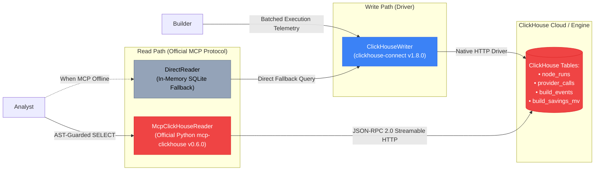

# CONFORM

<div align="center">

# CONFORM
### The Generative Media Compiler

**Compile generative media. Don't regenerate it.**

A smart build compiler and Google ADK orchestrator for AI video advertising slates. When prompts or advertising regulations change across 40 localized countries, CONFORM tracks what actually changed, shows you the bill before you spend a single dollar, waits for human approval, and rebuilds only the affected pieces — saving 95%+ in video generation costs with byte-exact cryptographic proof.

[](https://opensource.org/licenses/Apache-2.0)
[](https://agentic-cinema.devpost.com/)
[](https://clickhouse.com/)
[](https://cloud.google.com/vertex-ai)
[](https://github.com/google/adk-python)
[-brightgreen.svg)](tests/)
[](https://github.com/astral-sh/ruff)
[](https://cloud.google.com/run)

**[🌐 Open Hosted Live Demo](https://conform-tiwoc77ijq-ew.a.run.app)** · **[🎥 Watch Demo Video](docs/demo_recording.mp4)** · **[🏆 Devpost Submission](docs/DEVPOST_SUBMISSION.md)** · **[📜 Provenance & Clean IP](PROVENANCE.md)**

</div>

---

## The 30-Second Elevator Pitch (In Plain English)

> **If you edit one typo on page 42 of a printed book, you don't pay an author to rewrite the entire book from chapter one. You just reprint page 42.**

Current AI video pipelines don't know how to do that. If you create a commercial adapted for 40 countries, and a European regulator asks for a longer legal disclaimer in Germany and France, today's AI video tools **regenerate every single video clip, voiceover, and image from scratch**. That burns hundreds of dollars on expensive video AI (like Google Veo 3.1) and takes an hour.

**CONFORM is the first smart compiler for generative video.** Like a programmer's build system (like `make` or `webpack`), it traces the exact recipe of your video. It leaves the expensive video footage and music completely untouched, rebuilds *only* the legal text that changed, shows you the price tag first, and waits for your approval before spending a single penny.

---

## Plain English Glossary: Decoding the Jargon

You don't need a PhD in compiler theory to understand CONFORM. Here is what the technical terms mean in everyday language:

| Technical Term | What It Means in Plain English | Real-World Metaphor |
|---|---|---|
| **"Blast Radius"** | **The Splash Zone / Ripple Effect.** When you change a word or rule, which specific files are affected, and which ones are untouched? | If you spill coffee on your desk, the blast radius is the documents that got wet — not the books on the high shelf. |
| **"Dirty" Asset** | **Needs Updating.** An asset whose prompt, rule, or upstream ingredients changed. This is the only thing we re-render. | A draft page with red ink corrections that must be re-typed. |
| **"Clean" Asset** | **Already Done / Free to Reuse.** An asset whose ingredients haven't changed. Reused instantly at **$0.00 cost** and 0 seconds. | A finished page that doesn't have any corrections. Keep it as-is. |
| **"Fingerprint" (Canonical Hash)** | **Digital ID Card / Barcode.** A unique 64-character code calculated from the exact prompt, settings, and seed. If the prompt hasn't changed, the ID is identical, so CONFORM grabs the existing video from the shelf instead of paying to generate it again. | A grocery barcode. If two cans of soup have the exact same ingredients, they get the exact same barcode. |
| **"DAG" (Directed Acyclic Graph)** | **The Production Recipe / Flowchart.** The step-by-step flowchart connecting your script $\rightarrow$ storyboard $\rightarrow$ video clips $\rightarrow$ voiceover $\rightarrow$ final packaged commercial. | A baking recipe: flour + sugar $\rightarrow$ batter $\rightarrow$ oven $\rightarrow$ cake $\rightarrow$ frosting. |
| **"Human Approval Gate"** | **The Credit-Card Safeguard.** The AI is physically locked. It cannot run video generation models or incur costs until a human reviews the quote and clicks "Approve". | An online shopping checkout cart where you must click "Confirm Payment" before your card is charged. |
| **"Byte-Exact Verification"** | **The Digital Tamper Seal.** Cryptographic proof that the video delivered to an ad network matches what was approved, down to the exact 1 and 0 bits. | The unbroken plastic seal on a medicine bottle proving nobody tampered with the contents. |
| **"ClickHouse Telemetry"** | **The Real-Time Production Accountant.** A lightning-fast analytical flight recorder tracking every millisecond, penny, and token spent across 40 countries, queryable in plain English. | A flight data black box that records every dial and engine metric during flight. |

---

## Quick Links

| Resource | Description | Location |
|---|---|---|
| **Live Hosted Demo** | Interactive Cloud Run app running in **Public Judge Mode** with cached media & MCP reads | [conform-tiwoc77ijq-ew.a.run.app](https://conform-tiwoc77ijq-ew.a.run.app) |
| **Demo Video** | 3-minute technical walkthrough demonstrating blast radius, approval gate, and byte verification | [docs/demo_recording.mp4](docs/demo_recording.mp4) |
| **Devpost Submission** | Full submission package, inspiration, challenges, and track criteria answers | [docs/DEVPOST_SUBMISSION.md](docs/DEVPOST_SUBMISSION.md) |
| **Clean IP Provenance** | Detailed provenance log verifying new contest-period work, Google-only AI, and zero prior code | [PROVENANCE.md](PROVENANCE.md) |
| **Architectural Invariants** | Core laws, LLM/deterministic boundary rules, and state machine invariants | [AGENTS.md](AGENTS.md) |
| **Product Specification** | Complete functional and non-functional engineering requirements | [docs/PRD.md](docs/PRD.md) |

---

## Why We Built It — The $10,000 Text Edit Problem

Imagine you run an advertising studio launching a global campaign for a new electric car: **"Aurora EV"**.

The production flowchart has multiple creative stages that fan out across **40 country variants** (different languages, regulatory disclaimers, and local voiceovers):

$$\text{Brief} \longrightarrow \text{Shot Plan} \longrightarrow \text{Keyframe Stills} \longrightarrow \text{Video Clips} \longrightarrow \text{Copy} \longrightarrow \text{Voiceover} \longrightarrow \text{Music} \longrightarrow \text{Final Master Package}$$

```
                        [Master Brief: Aurora EV]
                                   │
                           [8-Axis Shot Plan]
                                   │
                    ┌──────────────┴──────────────┐
             [Keyframe 1: Desert]          [Keyframe 2: City]
                    │                              │
               [Veo Clip 1]                   [Veo Clip 2]
                    │                              │
    ┌───────────────┴──────────────────────────────┴───────────────┐
    │                                                              │
[German Copy] ──┐                                            [French Copy] ──┐
                ▼                                                            ▼
    [German Package] (DIRTY)                                     [French Package] (DIRTY)
    ┌──────────────────────────────────────────────────────────────┐
    │  ... 38 Other Clean Countries (US, JP, GB, CA, BR...)        │
    │  (Reused byte-for-byte at $0.00 spend and 0s render time)   │
    └──────────────────────────────────────────────────────────────┘
```

### The Crisis
A new European Union regulation lands:
> *"All automotive advertisements in Germany and France must carry an updated 40-character battery recycling disclosure."*

- **The Old Way (Blind Regeneration):**
  Because current AI video platforms have no concept of dependency tracking, you have to click **"Regenerate All"**.
  - All 252 video files, audio tracks, and images re-render.
  - Video models like Google Veo 3.1 re-render the same car driving through the desert 40 times.
  - Cost: **$63.00+** in wasted cloud credits.
  - Time: **45 minutes** of GPU queues.
  - Quality Risk: Generative video is random—the car's wheels and reflections subtly change, introducing visual errors.

- **The CONFORM Way (Smart Compilation):**
  CONFORM inspects the dependency tree:
  1. **Calculates the Splash Zone (Blast Radius):** Only **12 of 252 assets** are affected (the German & French copy and final video muxes). **240 assets are completely clean**.
  2. **Gives You the Bill Before Spending:** Rebuild cost is **$0.0030** instead of $0.0630 (**95.2% savings**).
  3. **Waits for Your Approval:** Nothing starts generating until you review the quote and click "Approve".
  4. **Rebuilds Only the 12 Dirty Pieces:** It updates the German and French text files in 2 seconds. The 240 expensive Veo video clips, Imagen keyframes, and music tracks are fetched instantly from storage at **$0.00 cost**.
  5. **Logs to ClickHouse:** Every penny, millisecond, and cache hit is recorded into ClickHouse Cloud for real-time cost audits.
  6. **Proves It's Untampered:** Mathematically verifies that every video delivered to the ad network matches what you approved.

---

## Why It Stands Out — The 6 Architectural Laws

### 1. The LLM / Deterministic Boundary
> **The Golden Rule:** The AI (Gemini) is only allowed to *interpret* human text into structured contracts and *explain* data. It is **never** allowed to calculate numbers.

- An LLM **never** invents a hash, calculates a cost, determines what to rebuild, or decides if a test passed. Those are handled by 100% deterministic Python and SQL.
- This rule is enforced by an automated code-inspection test (`tests/test_boundary.py`) that physically fails if any core calculation file tries to import an AI model.

### 2. Cache Determinism, Not Model Determinism
AI models never produce the exact same pixels twice. CONFORM solves this with **Cache Determinism**:
- Every asset receives a digital ID card (hash) based on its exact prompt, settings, and recipe:
  $$\text{Fingerprint} = \text{SHA-256}(\text{Canonical}(\text{Inputs} \mathbin{\Vert} \text{Recipe}))$$
- If the inputs haven't changed, the ID is identical. CONFORM grabs the existing video bytes from storage instead of calling the AI model again.

### 3. Pre-Spend Safeguard (No Approval = No Bill)
- The build engine strictly **refuses to run** (`HTTP 409 NOT_APPROVED`) if called before human approval.
- The approval locks the exact state of the project. If someone edits a prompt after you approved the bill, the build refuses to run (`STALE_APPROVAL`) until re-approved.

### 4. ClickHouse Telemetry & Official MCP Sidecar (Partner Track)
- **Ultra-Fast Ingestion (Write Path):** Every attempt, cache hit, retry, and latency metric streams into ClickHouse Cloud using the high-throughput `clickhouse-connect` driver.
- **Natural Language Analyst (Read Path):** The built-in AI Analyst answers questions like *"How much did we spend on video today?"* by communicating exclusively through the official Python **`mcp-clickhouse`** MCP server over JSON-RPC 2.0.
- **Read-Only Safety Guard:** All generated SQL is inspected by an internal parser to ensure it only performs safe, read-only `SELECT` queries with strict row limits.

### 5. Google ADK Agent with Pause & Resume (`google-adk==2.8.0`)
- Built using the official Google Agent Development Kit (`google.adk`).
- The agent autonomously interprets briefs, calculates blast radius, and prepares estimates, but **pauses** before building. It issues a resumption token that waits for human approval before resuming execution.

### 6. Cryptographic Proof & Live Tamper Studio
- A release is an unchangeable manifest of expected file hashes.
- CONFORM downloads the actual generated files cold from storage and re-hashes every byte.
- Includes a live **Tamper Demonstration Studio**: corrupting just 1 byte of data in storage causes release verification to immediately fail bright red (`MISMATCH / TAMPERED`), giving clients proof of delivery integrity.

---

## Architecture Diagrams

### High-Level Agentic Flow

```mermaid
graph TB
    subgraph "Human Interface"
        UI["Web UI<br/>(React 19 + TypeScript + Vite)"]
        Judge["Producer / Client"]
    end

    subgraph "AI Agent Layer (google-adk + google-genai)"
        Coord["ADK Coordinator Agent<br/>(State Machine Orchestrator)"]
        Interp["Interpreter Tool<br/>(Gemini → Structured Contract)"]
        Analyst["Analyst Agent<br/>(Plain English → Guarded SQL)"]
    end

    subgraph "Deterministic Core (Pure Python — ZERO AI)"
        FP["Fingerprint Engine<br/>(JCS RFC 8785 + SHA-256)"]
        Graph["DAG Production Graph<br/>(Recipe Dependencies)"]
        Dirty["Blast Radius Computer<br/>(Splash Zone Resolution)"]
        Cost["Cost Estimator<br/>(Exact Decimal Accounting)"]
        Builder["Build Engine<br/>(Rebuilds Dirty Pieces Only)"]
        Verify["Release Verifier<br/>(Byte-Exact Re-hashing)"]
    end

    subgraph "Generative Foundation Models (Vertex AI)"
        Text["Gemini 3 Pro / 3.1 Flash<br/>(Director & Copywriter)"]
        Image["Imagen 4<br/>(Storyboard Concept Stills)"]
        Video["Veo 3.1 Fast<br/>(Cinematic Video Clips)"]
        Audio["Chirp 3 HD & Lyria 2<br/>(Voiceover & Soundtrack)"]
        FFmpeg["FFmpeg<br/>(Final Muxing — NO AI)"]
    end

    subgraph "Data & Storage Layer"
        CH["ClickHouse Cloud<br/>(Telemetry & Savings MV)"]
        MCP["mcp-clickhouse<br/>(Official MCP Server Sidecar)"]
        GCS["Google Cloud Storage<br/>(Content-Addressed Media)"]
    end

    Judge -->|"1. Submit Brief or Rule Change"| UI
    UI -->|"POST /api/changes"| Coord
    Coord -->|"Interpret Text"| Interp
    Coord -->|"Compute Splash Zone"| Dirty
    Dirty --> FP
    Dirty --> Cost
    Coord -->|"2. Show Quote: $0.0030 (95% saved)"| UI
    UI -->|"🛑 Human Approval Gate"| Judge
    Judge -->|"3. Click Approve Spend"| UI
    UI -->|"POST /approve"| Coord
    Coord -->|"4. Rebuild Only Dirty Items"| Builder
    Builder -->|"Render Video (if dirty)"| Video
    Builder -->|"Render Images (if dirty)"| Image
    Builder -->|"Mux Media"| FFmpeg
    Builder -->|"Save New Bytes"| GCS
    Builder -->|"Log Penny & Millisecond"| CH
    Coord -->|"5. Verify Cryptographic Integrity"| Verify
    Verify -->|"Check Raw Bytes"| GCS
    UI -->|"6. Ask Plain-English Question"| Analyst
    Analyst -->|"Guarded SELECT via MCP"| MCP
    MCP -->|"JSON-RPC 2.0"| CH
    Analyst -->|"Answer with Receipts"| UI

    style Coord fill:#6366f1,stroke:#4f46e5,color:#fff
    style Interp fill:#6366f1,stroke:#4f46e5,color:#fff
    style Analyst fill:#6366f1,stroke:#4f46e5,color:#fff
    style FP fill:#10b981,stroke:#059669,color:#fff
    style Graph fill:#10b981,stroke:#059669,color:#fff
    style Dirty fill:#10b981,stroke:#059669,color:#fff
    style Cost fill:#10b981,stroke:#059669,color:#fff
    style Verify fill:#10b981,stroke:#059669,color:#fff
    style Builder fill:#10b981,stroke:#059669,color:#fff
    style Text fill:#f59e0b,stroke:#d97706,color:#000
    style Image fill:#f59e0b,stroke:#d97706,color:#000
    style Video fill:#f59e0b,stroke:#d97706,color:#000
    style Audio fill:#f59e0b,stroke:#d97706,color:#000
    style FFmpeg fill:#94a3b8,stroke:#64748b,color:#000
    style CH fill:#ef4444,stroke:#dc2626,color:#fff
    style MCP fill:#ef4444,stroke:#dc2626,color:#fff
    style GCS fill:#3b82f6,stroke:#2563eb,color:#fff
```



### ClickHouse Dual-Path Architecture



---

## The Media Pipeline: Meet the AI Crew

Every asset in the campaign is built by a specialized Google foundation model or deterministic tool, assigned like a professional film crew:

| Node Type | Film Crew Role | Tool / Model | What It Does | Why CONFORM Caches It |
|---|---|---|---|---|
| `source` | **The Executive Producer** | `gemini-3-pro` | Turns raw campaign ideas into a cohesive concept. | Cached once per campaign. |
| `shot_plan` | **The Film Director** | `gemini-3-pro` | Plans camera lenses, angles, lighting, and action. | Cached once; directs all visual scenes. |
| `keyframe` | **The Concept Artist** | `imagen-4` | Paints high-res still frames to anchor visual look. | **Shared across all 40 countries.** |
| `clip` | **The Cinematographer** | `veo-3.1-fast` | Generates 4–8s high-motion cinematic footage. | **Most expensive stage (>80% of cost). 100% reused when copy changes.** |
| `copy` | **The Multilingual Copywriter** | `gemini-3.1-flash` | Translates headlines & legal text for 40 countries. | Fast & cheap. The only thing rebuilt on a text edit. |
| `voiceover` | **The Voice Actors** | `chirp-3-hd` / Gemini TTS | Speaks dialogue with native regional accents. | Localized per country; timed to match video. |
| `music` | **The Composer** | `lyria-2` | Composes soundtrack score matching the scene mood. | Created once per campaign; shared globally. |
| `package` | **The Post-Production Editor** | **FFmpeg (Zero AI)** | Cuts, timed-captions, and muxes final MP4 files. | Pure mathematical assembly—zero AI hallucinations. |

---

## Deep Dive: How the Generative AI Stack Powers CONFORM

### 1. Google Veo 3.1 (`veo-3.1-fast-generate-001`) — The High-Cost Video Engine
- **Why it matters:** Generating video with AI is computationally heavy. A 6-second cinematic video clip takes 30–60 seconds of GPU time and costs substantially more than text or images.
- **How CONFORM saves your Veo budget:** Upstream video clips are shared across all 40 countries. When a German legal disclaimer changes, CONFORM checks the digital ID of the Veo video. Because the visual scene didn't change, CONFORM fetches the existing MP4 from cloud storage at **$0.00 cost and 0ms render time**, eliminating GPU waste and preventing accidental visual changes.

### 2. Google Imagen 4 (`imagen-4`) — Style Continuity & Keyframe Anchors
- **Why it matters:** Generative video can easily suffer from "character drift"—where an actor's face, clothes, or car look different from shot to shot. Imagen 4 creates crisp, frozen visual reference plates before video generation starts.
- **Compiler Invariant:** The Imagen keyframe is created once for the master campaign. All 40 localized country versions reference this exact visual anchor.

### 3. Dual-Tier Gemini Intelligence
CONFORM uses the right model for the right job:
- **`gemini-3-pro` (The Deep Thinker):** Analyzes complex regulations, plans camera angles, ensures 180-degree cinematography rules are followed, and powers the natural-language analytics assistant.
- **`gemini-3.1-flash` (The Rapid Translator):** Generates 40 localized headlines, slogans, and legal disclosures in milliseconds under strict length constraints so text fits perfectly on screen.

### 4. Google Chirp 3 HD & Lyria 2 — Studio Audio & Score
- **Chirp 3 HD / Gemini TTS:** Produces studio-grade voiceover in native accents (German, French, Japanese, etc.), dynamically paced so translated speech never exceeds the video shot length.
- **Lyria 2:** Composes original orchestral and electronic scores tailored to the campaign emotion, shared across all 40 country deliverables.

### 5. FFmpeg — Pure Deterministic Packaging (Why We Say NO to AI Here)
- Media assembly must **never** be handed to an LLM. Video encoding, subtitle burning, and audio mixing require exact mathematical precision. CONFORM uses pure FFmpeg binaries (`libx264`, `aac`, timed SRT subtitles), guaranteeing broadcast-standard audio levels (-24 LKFS) and zero visual corruption.

---

## Deep Dive: ClickHouse — The Real-Time Financial Accountant

Why did CONFORM choose ClickHouse for the **ClickHouse Partner Track**?

In a global production slate, every compilation generates thousands of micro-events: node start times, token counts, fractional-cent costs, retry attempts, and cache hits across 40 countries. Traditional relational databases bog down trying to compute live totals across this volume of data. **ClickHouse calculates instant, sub-millisecond aggregations across millions of events.**

### 1. High-Throughput Flight Recorder (`clickhouse-connect`)
Every time a node runs, an attempt is made, or an asset is reused, structured telemetry is streamed directly into ClickHouse Cloud:
- `node_runs`: Tracks execution IDs, states (`rebuilt` vs `cache_hit`), and elapsed milliseconds.
- `provider_calls`: Logs individual API calls with model IDs (`veo-3.1-fast`, `gemini-3-pro`), token counts, and micro-dollar costs.
- `build_events`: Records permanent records of every compilation milestone.

### 2. The Real-Time Savings Calculator (`build_savings_mv`)
ClickHouse maintains an active Materialized View that calculates your exact ROI live:
$$\text{Avoided Spend} = \sum_{\text{reused}} \text{Baseline Generation Price} - \text{Actual Incremental Cost}$$
Producers see live metrics:
- **Cumulative Dollars Saved:** Exact money saved by reusing Veo video and Imagen stills instead of re-rendering ($0.0630 naive vs. $0.0030 compiled — **95.2% savings**).
- **GPU Hours Saved:** Computing time eliminated across 40 countries.
- **Cache Hit Rate:** Visual gauge proving 95%+ asset reuse.

### 3. Official `mcp-clickhouse` Partner Protocol Integration
CONFORM strictly follows the official Model Context Protocol (MCP) required by the contest:
- **Zero Database Secrets in the Agent:** The AI Analyst Agent has no direct database password. All queries travel through the official Python **`mcp-clickhouse`** (v0.6.0) server running as an authenticated local sidecar.
- **Guarded SQL:** The agent's queries are filtered by an in-process security guard that only permits safe, read-only `SELECT` queries with mandatory row limits (`LIMIT 20`).
- **Ad Delivery & Click-Through Connection:** ClickHouse's high-speed analytics allow marketing teams to correlate which Veo shot or localized headline generated higher downstream click-through rates (CTR) and video completion rates (VCR).

### Sample Plain-English Questions Handled by ClickHouse MCP

| What You Ask in Plain English | What Runs Under the Hood in ClickHouse |
|---|---|
| *"What is our total spend breakdown across Veo, Imagen, and Gemini?"* | `SELECT model_id, sum(cost_usd) AS total_spend, count() AS call_count FROM provider_calls GROUP BY model_id ORDER BY total_spend DESC LIMIT 10` |
| *"Which countries had the highest cache hit rate during the EU update?"* | `SELECT territory, countIf(cache_hit = 1) / count() AS hit_rate FROM node_runs GROUP BY territory ORDER BY hit_rate DESC LIMIT 20` |
| *"How many transient provider retries were recovered automatically?"* | `SELECT count() AS recovered_retries FROM node_runs WHERE attempt > 1 AND error_class = 'transient'` |
| *"How much money did incremental compilation save us?"* | `SELECT sum(reused_nodes) * 0.005 AS estimated_dollars_saved FROM build_events WHERE event_type = 'BUILD_COMPLETED'` |

---

## Proof — The Code That Calls It

Judges can inspect the exact code files verifying runtime compliance:

- **Google ADK Agent Orchestration:** [`app/agents/adk_coordinator.py`](app/agents/adk_coordinator.py) calls `google.adk.Agent`, `Runner`, and runs typed ADK tools with pause-and-resume approval invariants.
- **Google GenAI / Vertex AI Endpoints:** [`app/providers/vertex.py`](app/providers/vertex.py) imports `google-genai` Client, dynamically dispatching to Veo 3.1, Imagen 4, and Gemini 3.
- **ClickHouse Write Path:** [`app/store/clickhouse_writer.py`](app/store/clickhouse_writer.py) imports `clickhouse_connect` to batch-insert run telemetry and query savings.
- **ClickHouse Official MCP Read Path:** [`app/store/mcp_client.py`](app/store/mcp_client.py) implements the client speaking JSON-RPC 2.0 to the official `mcp-clickhouse` server with AST SQL guards.
- **Loopback Sidecar Launcher:** [`app/serve.py`](app/serve.py) spawns the official Python `mcp-clickhouse` server as an authenticated local subprocess sidecar.
- **Deterministic Core & Boundary Enforcement:** [`app/core/canonical.py`](app/core/canonical.py) (RFC 8785 JCS), [`app/core/fingerprint.py`](app/core/fingerprint.py) (SHA-256 DAG hashing), and [`tests/test_boundary.py`](tests/test_boundary.py) (AST boundary verification).

---

## The 6-Stage Walkthrough

The web UI ([`web/`](web/)) provides a clear, step-by-step experience:

```
[Stage 1: Brief] ──▶ [Stage 2: Scan] ──▶ [Stage 3: Approve] ──▶ [Stage 4: Rebuild] ──▶ [Stage 5: Release] ──▶ [Stage 6: Analytics]
```

1. **Stage 1 — Brief & Preset:** Choose a campaign (*"Aurora EV"*) and trigger a compliance rule update (*EU Directive R-DISC-004: Minimum 40-character disclaimer in Germany and France*).
2. **Stage 2 — Instant Blast Radius Scan:** The dependency tree resolves immediately. Dirty items pulse amber on the graph. The system reports: **12 dirty / 240 clean**, quoting **$0.0030 rebuild cost** vs **$0.0630 naive regeneration** (95.2% saved).
3. **Stage 3 — Human Approval Gate:** The build is hard-locked. You review the quote and click "Approve Spend".
4. **Stage 4 — Incremental Rebuild:** Only the 12 dirty text and package files are re-rendered. The 240 clean video and audio files show instant green **CACHE HIT** badges at $0.00 cost.
5. **Stage 5 — Byte-Exact Tamper Studio:** The manifest is cryptographically verified against storage. Using the **Tamper Studio**, you can corrupt 1 byte of storage to watch verification immediately fail bright red (`MISMATCH`), proving uncompromised delivery.
6. **Stage 6 — Ask the Slate via ClickHouse MCP:** Ask questions in plain English to inspect your slate's financial receipts and cache efficiency.

---

## Quickstart (Cold Clone in 3 Minutes)

### Option A: Zero-Credential Local Fallback (Fastest)

CONFORM works out of the box with zero setup. If no API keys are provided, it automatically runs in clearly labelled offline fallback modes:

```bash
# 1. Clone the repository
git clone https://github.com/adetorojeremiahfadesayo/Conform.git
cd Conform

# 2. Set up Python virtual environment (Python 3.12+)
python -m venv .venv
# On Windows:
.venv\Scripts\activate
# On macOS / Linux:
source .venv/bin/activate

# 3. Install pinned dependencies
pip install -r requirements.txt

# 4. Start the backend server
python -m uvicorn app.api.main:app --port 8080
```

Open `http://localhost:8080` in your browser.

---

### Option B: Local API with Authenticated Official ClickHouse MCP Sidecar

To run the API alongside the official Python `mcp-clickhouse` server:

```bash
# Set your ClickHouse Cloud credentials in .env (or environment)
export CLICKHOUSE_HOST="your-instance.clickhouse.cloud"
export CLICKHOUSE_USER="default"
export CLICKHOUSE_PASSWORD="your-password"
export CLICKHOUSE_DATABASE="default"

# Launch the unified server (spawns official mcp-clickhouse sidecar + API)
python -m app.serve
```

Verify connection status:
```bash
curl http://localhost:8080/api/system/status
```

Look for `"clickhouse_read_mcp": "live_mcp"` in the JSON response.

---

### Option C: Production Docker Container

```bash
docker build -t conform:latest .
docker run -p 8080:8080 --env-file .env conform:latest
```

---

## Verification & Automated Test Suite

CONFORM ships with **125 automated tests** covering core invariants, boundary enforcement, and API safety:

```bash
# Run the full test suite (125 tests)
pytest

# Verify AST boundary separation (app/core imports zero LLMs)
pytest tests/test_boundary.py

# Verify Public Judge Mode restrictions & rate limits
pytest tests/test_judge_mode.py

# Verify ClickHouse MCP client protocol & SQL guards
pytest tests/test_mcp_client.py

# Run static linter
ruff check .
```

---

## Public Judge Mode Deployment

The live hosted URL (`https://conform-tiwoc77ijq-ew.a.run.app`) runs in **Public Judge Mode**:
- **Zero-Spend Protection:** Runs under a dedicated `conform-judge` service account with storage object-viewer access only and **zero Vertex AI permissions**. It cannot incur unexpected cloud spend.
- **Cache Preflight Guarantee:** Rebuilds are preflighted against cached media assets; uncached misses are safely refused (`503 JUDGE_CACHE_MISS`).
- **Abuse Prevention:** In-memory IP rate limiting, 8KB request payload caps, same-origin CORS, CSP headers, and strict endpoint allowlisting.
- **Full Verification Preserved:** Approval workflows, blast radius previews, ClickHouse MCP historical analytics, and in-memory byte tampering remain 100% interactive.

---

## Safety Rails & Disclaimers

> [!IMPORTANT]
> **Cache Determinism Notice:** Generative AI models are fundamentally non-deterministic. CONFORM does not claim model determinism. All determinism guarantees refer to **cache determinism**: identical inputs + identical recipe reuse content-addressed artifacts byte-for-byte.

> [!NOTE]
> **Compliance Rule Notice:** The rule evaluation engine implements **demo project rules only**. It does not constitute professional legal, regulatory, or advertising standards review.

> [!TIP]
> **Zero Secrets Policy:** No API keys, credentials, or private service account tokens are committed to this repository. All credentials are loaded strictly via environment variables or Secret Manager.

---

## License

This project is licensed under the **Apache-2.0 License**. See the full canonical license text in [LICENSE](LICENSE).
