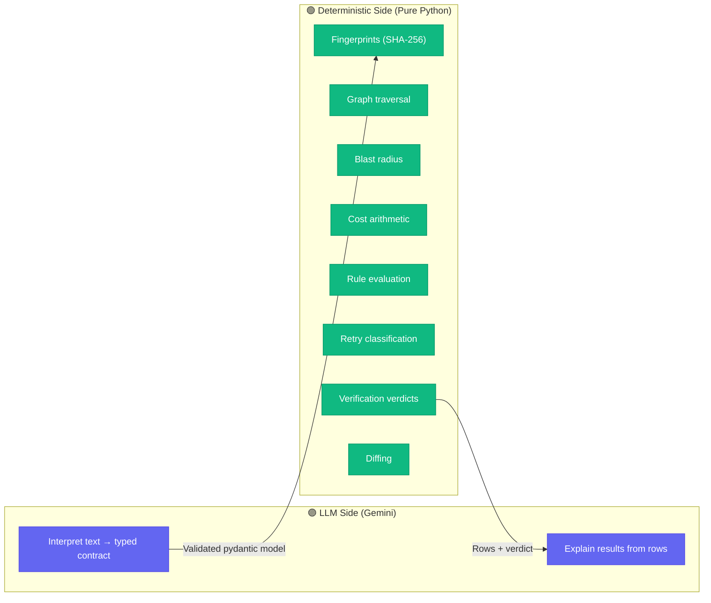
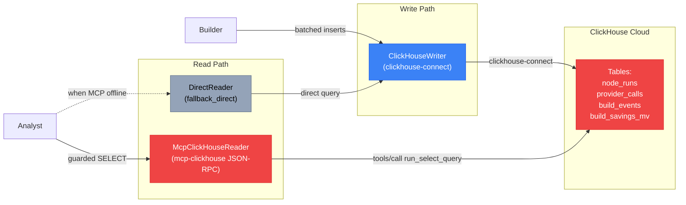

# CONFORM — System Architecture

## High-Level Agentic Flow

```mermaid
graph TB
    subgraph "Human Interface"
        UI["Web UI<br/>(React + TypeScript)"]
        Judge["Judge / Producer"]
    end

    subgraph "Agentic Layer (google-adk + google-genai)"
        Coord["Coordinator Agent<br/>(ADK Agent + Runner)"]
        Interp["Interpreter Tool<br/>(Gemini → ChangeIntent)"]
        Analyst["Analyst Agent<br/>(NL → SQL → Explanation)"]
    end

    subgraph "Deterministic Core (Pure Python — NO LLM)"
        FP["Fingerprint Engine<br/>(JCS RFC 8785 + SHA-256)"]
        Graph["DAG Graph Builder<br/>(Topological Sort)"]
        Dirty["Blast Radius Computer<br/>(Transitive Dirty-Set)"]
        Rules["Rule Engine<br/>(Demo Compliance Checks)"]
        Cost["Cost Estimator<br/>(Decimal Arithmetic)"]
        Verify["Release Verifier<br/>(Re-hash Byte-Exact)"]
        Retry["Retry Taxonomy<br/>(Transient / Permanent / Policy)"]
        Builder["Build Engine<br/>(Dirty-Only Rebuild)"]
    end

    subgraph "Generative Providers (Vertex AI)"
        Text["Gemini 3 Pro<br/>(Source, Shot Plan)"]
        Image["Imagen 4<br/>(Keyframes)"]
        Video["Veo 3.1<br/>(Video Clips)"]
        Audio["Chirp 3 HD<br/>(Voiceover)"]
        Music["Lyria 2<br/>(Music)"]
        FFmpeg["FFmpeg<br/>(Package — NO AI)"]
    end

    subgraph "Data Layer"
        CH["ClickHouse Cloud<br/>(Event Store)"]
        MCP["mcp-clickhouse<br/>(MCP Server)"]
        GCS["Google Cloud Storage<br/>(Content-Addressed Artifacts)"]
    end

    Judge -->|"Change Request"| UI
    UI -->|"POST /api/changes"| Coord
    Coord -->|"interpret(text)"| Interp
    Interp -->|"ChangeIntent"| Coord
    Coord -->|"compute_estimate()"| Dirty
    Dirty --> FP
    Dirty --> Graph
    Dirty --> Rules
    Dirty --> Cost
    Coord -->|"💰 Estimate + Blast Radius"| UI
    UI -->|"🛑 Human Approval Gate"| Judge
    Judge -->|"✓ Approve Spend"| UI
    UI -->|"POST /approve"| Coord
    Coord -->|"run_build(dirty_set)"| Builder
    Builder --> Retry
    Builder -->|"generate(node)"| Text
    Builder -->|"generate(node)"| Image
    Builder -->|"generate(node)"| Video
    Builder -->|"generate(node)"| Audio
    Builder -->|"generate(node)"| Music
    Builder -->|"mux(node)"| FFmpeg
    Builder -->|"store(sha256, bytes)"| GCS
    Builder -->|"emit(events)"| CH
    Coord -->|"verify_release()"| Verify
    Verify -->|"re-download + re-hash"| GCS
    UI -->|"Ask NL question"| Analyst
    Analyst -->|"Guarded SQL"| MCP
    MCP -->|"JSON-RPC 2.0"| CH
    MCP -->|"rows"| Analyst
    Analyst -->|"Explanation"| UI

    style Coord fill:#6366f1,stroke:#4f46e5,color:#fff
    style Interp fill:#6366f1,stroke:#4f46e5,color:#fff
    style Analyst fill:#6366f1,stroke:#4f46e5,color:#fff
    style FP fill:#10b981,stroke:#059669,color:#fff
    style Graph fill:#10b981,stroke:#059669,color:#fff
    style Dirty fill:#10b981,stroke:#059669,color:#fff
    style Rules fill:#10b981,stroke:#059669,color:#fff
    style Cost fill:#10b981,stroke:#059669,color:#fff
    style Verify fill:#10b981,stroke:#059669,color:#fff
    style Retry fill:#10b981,stroke:#059669,color:#fff
    style Builder fill:#10b981,stroke:#059669,color:#fff
    style Text fill:#f59e0b,stroke:#d97706,color:#000
    style Image fill:#f59e0b,stroke:#d97706,color:#000
    style Video fill:#f59e0b,stroke:#d97706,color:#000
    style Audio fill:#f59e0b,stroke:#d97706,color:#000
    style Music fill:#f59e0b,stroke:#d97706,color:#000
    style FFmpeg fill:#94a3b8,stroke:#64748b,color:#000
    style CH fill:#ef4444,stroke:#dc2626,color:#fff
    style MCP fill:#ef4444,stroke:#dc2626,color:#fff
    style GCS fill:#3b82f6,stroke:#2563eb,color:#fff
```

## The Deterministic / LLM Boundary

```mermaid
graph LR
    subgraph "🟣 LLM Side (Gemini)"
        A["Interpret text → typed contract"]
        B["Explain results from rows"]
    end

    subgraph "🟢 Deterministic Side (Pure Python)"
        C["Fingerprints (SHA-256)"]
        D["Graph traversal"]
        E["Blast radius"]
        F["Cost arithmetic"]
        G["Rule evaluation"]
        H["Retry classification"]
        I["Verification verdicts"]
        J["Diffing"]
    end

    A -->|"Validated pydantic model"| C
    I -->|"Rows + verdict"| B

    style A fill:#6366f1,stroke:#4f46e5,color:#fff
    style B fill:#6366f1,stroke:#4f46e5,color:#fff
    style C fill:#10b981,stroke:#059669,color:#fff
    style D fill:#10b981,stroke:#059669,color:#fff
    style E fill:#10b981,stroke:#059669,color:#fff
    style F fill:#10b981,stroke:#059669,color:#fff
    style G fill:#10b981,stroke:#059669,color:#fff
    style H fill:#10b981,stroke:#059669,color:#fff
    style I fill:#10b981,stroke:#059669,color:#fff
    style J fill:#10b981,stroke:#059669,color:#fff
```

## ClickHouse Dual-Path Architecture

```mermaid
graph LR
    subgraph "Write Path"
        W["ClickHouseWriter<br/>(clickhouse-connect)"]
    end

    subgraph "Read Path"
        MCP["McpClickHouseReader<br/>(mcp-clickhouse JSON-RPC)"]
        DR["DirectReader<br/>(fallback_direct)"]
    end

    subgraph "ClickHouse Cloud"
        DB["Tables:<br/>node_runs<br/>provider_calls<br/>build_events<br/>build_savings_mv"]
    end

    Builder -->|"batched inserts"| W
    W -->|"clickhouse-connect"| DB
    Analyst -->|"guarded SELECT"| MCP
    MCP -->|"tools/call run_select_query"| DB
    Analyst -.->|"when MCP offline"| DR
    DR -->|"direct query"| W

    style W fill:#3b82f6,stroke:#2563eb,color:#fff
    style MCP fill:#ef4444,stroke:#dc2626,color:#fff
    style DR fill:#94a3b8,stroke:#64748b,color:#000
    style DB fill:#ef4444,stroke:#dc2626,color:#fff
```
